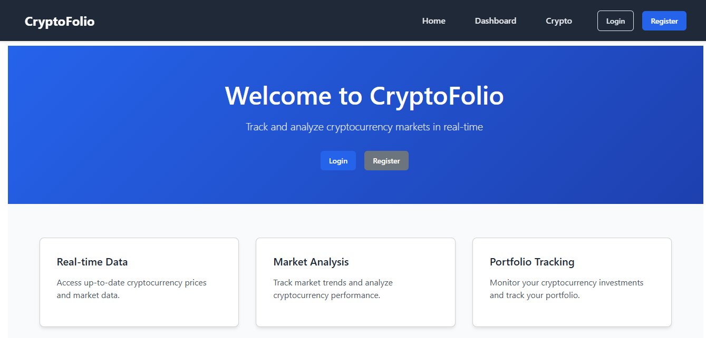
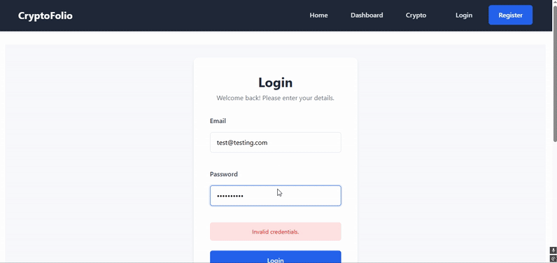
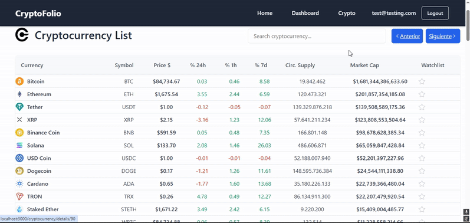

# CryptoFolio 📈

A cryptocurrency portfolio tracker and management application built with Node.js, Express, and Handlebars (HBS) as the template engine. This full-stack application allows users to track their favorite cryptocurrencies and manage their investment strategy through a clean and intuitive interface.

🌐 Live Demo: [CryptoFolio App](https://crypto-app-nine-kappa.vercel.app/)

## Screenshots 📸

### Home (/)


### Dashboard (/dashboard)


### Cryptocurrency List (/cryptocurrency) and details (/details)


## Features ✨

- **Real-time Cryptocurrency Tracking**: Monitor prices, market caps, and trends
- **Personal Portfolio**: Add your favorite cryptocurrencies to track
- **TODO Management**: Create and manage tasks for each cryptocurrency
- **User Authentication**: Secure login and registration system
- **Responsive Design**: Works on desktop and mobile devices

## Tech Stack 🛠

- **Backend**: Node.js + Express.js
- **Database**: MongoDB + Mongoose
- **Authentication**: Express-session
- **API Integration**: CoinLore API
- **Frontend**: Handlebars (HBS) + Bootstrap
- **Other Tools**: Chart.js for graphics
- **Hosting**: Vercel for deployment and hosting

## Installation 🛠

### Local Development
1. Clone the repository:
```bash
git clone [repository-url]
```

2. Install dependencies:
```bash
npm install
```

3. Create a `.env` file in the root directory with:
```env
PORT=3000
MONGODB_URI=your_mongodb_uri
SESSION_SECRET=your_session_secret
```

4. Start the application:
```bash
npm run dev
```

### Deployment on Vercel 🚀

1. Install Vercel CLI:
```bash
npm i -g vercel
```

2. Configure environment variables in Vercel:
   - Go to your Vercel Dashboard
   - Navigate to Project Settings > Environment Variables
   - Add the following variables:
```env
DB_REMOTE=your_mongodb_uri
SESSION_SECRET=your_session_secret
NODE_ENV=production
ORIGIN=your_vercel_app_url
```

3. Add `vercel.json` configuration:
```json
{
  "version": 2,
  "builds": [
    {
      "src": "app.js",
      "use": "@vercel/node"
    }
  ],
  "routes": [
    {
      "src": "/dashboard/add-comment",
      "methods": ["POST"],
      "dest": "app.js"
    },
    {
      "src": "/(.*)",
      "dest": "app.js"
    }
  ]
}
```

4. Deploy to Vercel:
```bash
vercel --prod
```

## Usage 💡

1. Register a new account or login
2. Browse the cryptocurrency list
3. Add favorites to your dashboard
4. Create TODOs for your cryptocurrency strategy
5. Track prices and market changes

## API Endpoints 🔌

- `GET /cryptocurrency/-100`: List all cryptocurrencies
- `GET /cryptocurrency/details/:id`: Get specific cryptocurrency details
- `PUT /cryptocurrency/add-favorite`: Add a cryptocurrency to favorites
- `DELETE /dashboard/remove-favorite/:id`: Remove from favorites
- `POST /dashboard/add-comment`: Add a TODO for a cryptocurrency

## Features in Development 🚧

- [ ] Price alerts system
- [ ] Integration with additional APIs (Binance, Coinbase, CoinMarketCap)
- [ ] Advanced portfolio analytics
- [ ] Real-time price updates
- [ ] Mobile app version
- [ ] Enhanced security features

## Contributing 🤝

Contributions are welcome! Please feel free to submit a Pull Request.

## License 📝

This project is licensed under the MIT License - see the [LICENSE](LICENSE) file for details.

## Acknowledgments 👏

- [Ironhack](https://www.ironhack.com/) - Project developed as part of the Web Development Bootcamp
- [CoinLore](https://www.coinlore.com/) - Cryptocurrency data API
- All contributors and testers

## Contact 📧

- LinkedIn: [Aitor Santaeugenia](https://www.linkedin.com/in/aitorjsantaeugenia/)
- GitHub: [AitorSantaeugenia](https://github.com/AitorSantaeugenia)